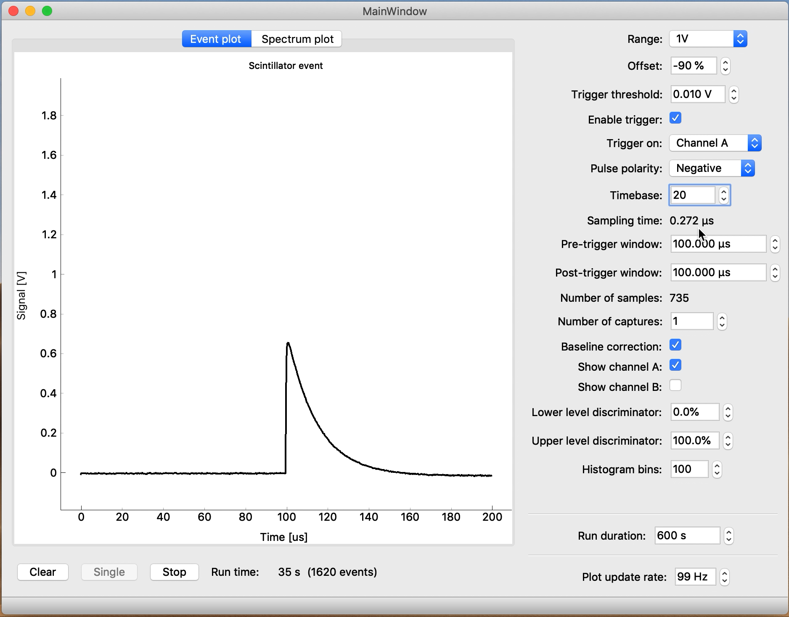
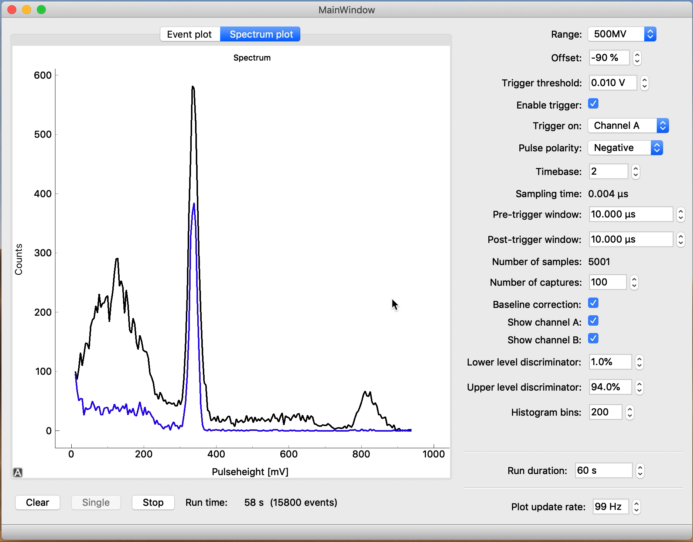

User Guide
==========

This is, for now, a very short overview of the software.

Connecting the hardware
-----------------------

Set up your detector. You can connect your detector to channel A on the PicoScope. Connect the PicoScope to a USB 3.0 port on your computer. That's it!

Using the software
------------------

   Screenshot of the GUI showing a plot of a gamma detection from a nuclear source (sodium-22). The green guides show the instant of triggering (vertically) as well as the trigger level (horizontally). The purple guides show the measured pulse height and the blue guide shows the measured baseline.

   Screenshot of the GUI showing a plot of the gamma spectrum of a nuclear source (sodium-22, black line). Another detector at the opposite side of the source picks up coincident annihilation radiation gammas. The green guide on the left shows the trigger level and the purple guide shows the minimum pulse height which can be reliably detected (due to baseline shifts). On the right, the red line shows the maximum pulse height which can be detected due to clipping at the upper range of the PicoScope. If you want to adjust the clipping level, change range and offset values accordingly.

Taking data
^^^^^^^^^^^

The data acquisition process is controlled using the three buttons in the lower left corner of the window.

Clear
   Clear all events from memory and start over.

Single
   Take a single measurement from the detector. You can use this to step through a few detections to get a feel for the shape of the signal.

Start/Stop
   Start or stop a data acquisition run. Data acquisition will run for the amount of time specified on the right under *Run duration* and then stop automatically.

Settings
^^^^^^^^

The *Event plot* window shows the range of the signal that can be accurately sampled. Try to fit your signals of interest just inside the window for maximum accuracy.

Range
   Specify the voltage range for the events of interest. If you a value which is too large, you can hardly see any events and they will not be accurately sampled. If you choose a value which is too low, many events will overflow.

Offset
   You can shift the baseline of the signal in either direction to make more room for the signals you're interested in.

Enable trigger
   When enabled, the hardware will only detect events above a certain threshold.

Trigger threshold
   Signals must cross this threshold to be detected. In other words, the pulse height must be greater than this value.

Trigger on
   Specify the hardware channel of the PicoScope which will be used for the trigger.

Pulse polarity
   If the detector outputs negative pulses, specify negative polarity to correctly trigger on the signals and analyze their pulse height.

Timebase
   A low value means taking a very short time between samples. Thus, the signal is more accurately sampled in time. Keep in mind, however, that taking a large number of samples per event in the case of a high event rate will result in application freezes. Adjust this value in steps to avoid a freeze.

Pre-trigger window / post-trigger window
   When taking data, the PicoScope will process events internally in a buffer. For each event, a small amount of data will be transferred to the computer. The amount of data is controlled in terms of the duration of the event. The pre-trigger window is the time window *before* the trigger that will be included. The post-trigger window specifies the amount of time *after* the trigger occurred. If you want to use a very short sampling time you can keep these values low to restrict the number of samples.

Number of captures
   When this value is larger than 1, the PicoScope will lock up until this number of events is detected and only then send data to the computer. This will generally result in a bit shorter dead time and in some cases lower CPU usage. Shorter dead time means that after detecting an event the hardware is quickly ready to detect another. If the dead time is too large, you will lose events.

Baseline correction
   For each event, the value of the pulse height is adjusted for the baseline level, which may shift a bit during the data run. This generally results in more accurate measurements.

Show Channel A / Show Channel B
   Enable or disable the PicoScope channels.

Upper threshold (SW)
   If signals cross this level on the trigger channel, the entire event is discarded. In other words, the signal must stay below this threshold. It works almost exactly as an upper trigger threshold. The difference is that this `trigger' is implemented in software, and that the baseline correction is performed on the data before applying this trigger. This makes it easy to select the upper threshold based on data in the spectrum plot since baseline fluctuations are eliminated.

Enable upper threshold
   When enabled, the software will only detect events below a certain threshold.

Lower level discriminator / Upper level discriminator
   In the *Spectrum plot* window, hide data outside the discriminator levels. Note that the data is not actually discarded. If you change the levels, hidden data can become visible again. This is in contrast to the *threshold levels*.

Histogram bins
   The number of bins in the histogram. This value can be adjusted during and after taking data, without loss of the original pulse height values.

Exporting data
^^^^^^^^^^^^^^

The spectrum shown onscreen can be exported using *File -> Export spectrum*.
